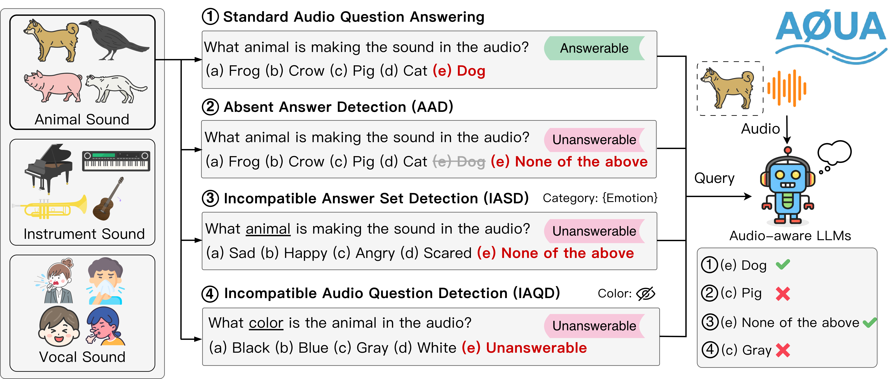

# AQUA-Bench: Beyond Finding Answers to Knowing When There Are None in Audio Question Answering

**Authors:** [Chun-Yi Kuan](https://kuan2jiu99.github.io/), [Hung-yi Lee](https://speech.ee.ntu.edu.tw/~hylee/index.php)

[](https://arxiv.org/abs/2601.12248)
[](https://ieeexplore.ieee.org/document/11460647/)
[](https://kuan2jiu99.github.io/aqua-bench/)

## Overview

AQUA-Bench is an evaluation benchmark for **unanswerable audio question answering**. It tests whether audio-aware large language models can recognize when a question cannot be answered, rather than always producing an answer.

**Keywords:** Unanswerable questions, Audio question answering, Audio-aware large language models



## Evaluation Data

### Main Benchmark

The main evaluation files are located at:

```
evaluation-data/AQUA-Bench-{domain}-Sounds-Track.json
```

where `domain` ∈ {`Animal`, `Musical-Instruments`, `Vocal-Sounds`}.

Each file is a JSON list. Every entry contains the following keys:

| Key | Description |
|-----|-------------|
| `type` | One of `solvable`, `AAD` (Absent Answer Detection), `IASD` (Incompatible Answer Set Detection), or `IAQD` (Incompatible Audio Question Detection). |
| `question` | The question prompt for the model. |
| `answer` | The ground-truth answer. |
| `audio_filename` | The filename that maps to the original source dataset. See [Evaluation Steps](#evaluation-steps) to download the source datasets and resolve the correct audio path. |

### Ablation Variants

We provide three ablation variants that modify the unanswerable option phrasing. Results for all variants are available on the [demo page](https://kuan2jiu99.github.io/AQUA-Bench-demo/).

**Design 1** (`*-Design1.json`): Replaces the default unanswerable options with softer alternatives.
- AAD / IASD: "None of the above" → "No correct answer"
- IAQD: "Unanswerable" → "Cannot be determined from the given information"

**Design 2** (`*-Design2.json`): Uses more explicit unanswerable phrasing.
- AAD / IASD: "None of the above" → "All answers are incorrect"
- IAQD: "Unanswerable" → "Insufficient information to answer"

**Uncertainty** (`*-Uncertainty.json`): Appends an explicit hint to each question.
- AAD / IASD: Adds *"Select 'None of the above' if you believe none of the listed answers is right."*
- IAQD: Adds *"Pick 'Unanswerable' when the audio lacks the details needed to decide."*

## Evaluation Steps

### 1. Download Source Datasets

| Domain | Dataset | Link |
|--------|---------|------|
| Animal Sounds | ESC-50 | [GitHub](https://github.com/karolpiczak/ESC-50) |
| Musical Instruments Sounds | Music Instrument Sounds | [Kaggle](https://www.kaggle.com/datasets/abdulvahap/music-instrunment-sounds-for-classification) |
| Vocal Sounds | VocalSound | [GitHub](https://github.com/YuanGongND/vocalsound) |

### 2. Run Inference

Use the evaluation metadata in `evaluation-data/` to prompt your model. Save the model's output in a `response` column within the original evaluation metadata format.

### 3. Run Evaluation

```bash
python evaluation.py --results_path YOUR_RESULTS_PATH
```

## Citation

If you find this benchmark useful, please cite:

```bibtex
@inproceedings{kuan2026aqua,
  title     = {AQUA-Bench: Beyond Finding Answers to Knowing When There Are None in Audio Question Answering},
  author    = {Kuan, Chun-Yi and Lee, Hung-yi},
  booktitle = {ICASSP 2026 - 2026 IEEE International Conference on Acoustics, Speech and Signal Processing (ICASSP)},
  pages     = {16262--16266},
  year      = {2026},
  doi       = {10.1109/ICASSP55912.2026.11460647}
}
```

## References

- [1] ESC-50: Dataset for Environmental Sound Classification
- [2] Music Instrument Sounds for Classification
- [3] VocalSound: A Dataset for Improving Human Vocal Sounds Recognition